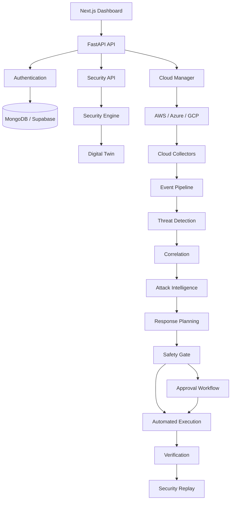

# Aegivion

### Autonomous Multi-Cloud Security Management & Intelligence Platform

Real Cloud Data → Security Digital Twin → Threat Detection →
Attack Intelligence → Risk Analysis → Safe Response → Verification


---

## 2. 🌐 Project Overview

### What is Aegivion?

Aegivion is a multi-cloud security platform designed to collect cloud security data, build a security representation of cloud environments, detect security events, correlate evidence, analyze attack paths, predict potential next-stage activity, and recommend or execute controlled responses through policy and approval boundaries.

### Problem

Traditional cloud security systems often separate:
- Cloud monitoring
- Threat detection
- Risk analysis
- Attack path analysis
- Response

Aegivion connects these stages into one continuous security intelligence pipeline.

### Core idea

```text
REAL CLOUD
     ↓
CLOUD DATA
     ↓
SECURITY DIGITAL TWIN
     ↓
EVENT INTELLIGENCE
     ↓
THREAT DETECTION
     ↓
CORRELATION
     ↓
ATTACK ACTIVATION
     ↓
ATTACK PATH
     ↓
PREDICTION
     ↓
RESPONSE PLANNING
     ↓
SAFETY POLICY
     ↓
CONTROLLED RESPONSE
     ↓
VERIFICATION
     ↓
SECURITY REPLAY
```

---

## 3. 🚀 Key Features

| Feature           | Description                                       |
| ----------------- | ------------------------------------------------- |
| Multi-cloud       | AWS, Azure and GCP integration                    |
| Asset Inventory   | Normalized cloud asset inventory                  |
| Digital Twin      | Security representation of cloud resources        |
| Event Pipeline    | Validation, normalization and deduplication       |
| Threat Detection  | Credential, exfiltration and ransomware signals   |
| Correlation       | Converts related signals into incident storylines |
| Attack Activation | Measures active attack behavior                   |
| Attack Path       | Dynamic path/risk analysis                        |
| Prediction        | Estimates plausible next-stage activity           |
| Simulation        | Read-only blast-radius analysis                   |
| Response Planning | Generates response candidates                     |
| Safety Gate       | Prevents unsafe automated actions                 |
| Verification      | Confirms whether response reduced risk            |
| Replay            | Reconstructs security decision traces             |

---

## 4. 🏗️ Architecture



---

## 5. 🔄 Security Intelligence Pipeline

```text
Cloud Event
    ↓
Validation
    ↓
Normalization
    ↓
Deduplication
    ↓
Security Event Store
    ↓
Digital Twin Context
    ↓
┌───────────────────────┐
│ Independent Detectors │
├───────────────────────┤
│ Credential Compromise │
│ Data Exfiltration     │
│ Ransomware            │
└───────────────────────┘
    ↓
Correlation
    ↓
Incident Storyline
    ↓
Attack Activation
    ↓
Dynamic Attack Path
    ↓
Prediction
    ↓
What-If Simulation
    ↓
Minimum-Impact Response
    ↓
Safety Policy
    ↓
Approval / Allow
    ↓
Controlled Execution
    ↓
Verification
    ↓
Security Replay
```

---

## 6. ☁️ Multi-Cloud

### AWS
- IAM Users, Roles, Policies
- EC2 Instances
- S3 Buckets
- VPC, Subnets
- Security Groups
- CloudTrail integration
- Inter-resource relationships

### Azure
- Native discovery and security architecture mapping
- Resource group and identity validation

### GCP
- Asset discovery
- Resource relationships
- Security context mapping
- Attack-path groundwork

*Note: Multi-cloud integrations are implemented; real-world production execution on Azure/GCP is actively being validated.*

---

## 7. 🧬 Security Digital Twin

The Digital Twin is **not just a duplicate database model**. It is a dynamic state representation.

```text
Cloud Assets
     +
Relationships
     +
Security Context
     +
Events
     +
Historical State
     =
Security Digital Twin
```

It enables real-time asset context, relationship graphs, security state verification, event impact assessment, and historical context tracking.

---

## 8. 🚨 Threat Detection

Three independent heuristic and ML-backed detectors run concurrently:

### Credential Compromise
Detects suspicious behavior patterns such as anomalous IP logins, impossible travel, and privilege escalation attempts.

### Data Exfiltration
Monitors for:
- Unusual access patterns
- Object enumeration
- Suspicious downloads
- Large data movement

### Ransomware / Destruction
Tracks destructive activity signals like mass deletions, bulk encryption events, and backup tampering. 
*(Note: These represent detection signals, not definitive proof of an active attack without correlation.)*

---

## 9. 🧠 Attack Intelligence

```text
Correlation Engine
        ↓
Attack Activation Engine
        ↓
Dynamic Path Risk
        ↓
Prediction Engine
        ↓
Simulation Engine
```

> **Important:** Predictions represent *plausible* next-stage activity. They are treated as probabilistic signals for defense prioritization, not as certainty.

---

## 10. 🛡️ Autonomous Response

Aegivion **does not allow an AI component to directly execute arbitrary cloud actions**.

```text
AI Recommendation
       ↓
Response Candidate
       ↓
Safety Policy
       ↓
Action Gate
       ↓
┌─────────┬─────────────────┬─────────┐
│ BLOCK   │ REQUIRE APPROVAL│ ALLOW   │
└─────────┴─────────────────┴─────────┘
                         ↓
                    Executor
                         ↓
                    Verification
```

Every automated response accounts for reversibility, business impact, blast radius, execution confidence, and strict approval requirements to prevent destructive actions.

---

## 11. 🔁 Security Replay

The system can reconstruct the entire lifecycle of an incident:

```text
Events → Detectors → Correlation → Activation → Attack Path → Prediction → Simulation → Response Candidate → Policy Decision → Approval → Execution → Verification
```
This enables comprehensive auditability and offline debugging.

---

## 12. 🔐 Authentication & Authorization

```text
Google OAuth / Microsoft OAuth
       ↓
Aegivion User
       ↓
Organization
       ↓
Membership
       ↓
Role (Super Admin, Admin, Analyst, Read-Only)
```

The system uses standard JWT access and refresh tokens. All API routes are protected by tenant isolation, membership validation, and strict Role-Based Access Control (RBAC).

---

## 13. 🧰 Technology Stack

| Layer          | Technology                 |
| -------------- | -------------------------- |
| Frontend       | Next.js, React, TypeScript |
| UI             | Tailwind CSS, shadcn/ui    |
| Backend        | FastAPI, Python 3.10+      |
| Authentication | OAuth 2.0 + JWT            |
| Database       | MongoDB + Supabase         |
| Cloud          | AWS, Azure, GCP            |
| AWS SDK        | boto3                      |
| Security       | Custom security engines    |
| AI             | Aegivion AI modules        |
| Containers     | Docker, Docker Compose     |
| Monitoring     | Prometheus                 |
| Testing        | Pytest                     |
| Load Testing   | Locust                     |

---

## 14. 📂 Repository Structure

```text
aegivion/
│
├── packages/
│   ├── backend/      # FastAPI REST API & Core Orchestration
│   ├── frontend/     # Next.js React Dashboard
│   ├── security/     # Core Security Detection Engines
│   ├── ai/           # AI Intelligence Modules
│   └── algo/         # Specialized Detection Algorithms
│
├── .github/          # GitHub Actions CI/CD workflows
├── docs/             # Technical Documentation
├── docker-compose.yml
├── docker-compose.prod.yml
├── nginx.conf
├── prometheus.yml
├── supabase_schema.sql
├── locustfile.py
├── README.md
└── .env.example
```

---

## 15. ⚙️ Installation

```bash
git clone https://github.com/arijitghosh8768-arch/Aegivion.git
cd Aegivion
```

Start the platform via Docker:
```bash
docker-compose up -d
```

Requirements: Docker, Node.js (v18+), Python (3.10+).

---

## 16. 🔑 Environment Configuration

Create a `.env` file based on `.env.example`:

```env
MONGODB_URI=mongodb://localhost:27017/aegivion
SUPABASE_URL=https://your-project.supabase.co
SUPABASE_KEY=your-service-role-key

JWT_SECRET=super-secret-key

GOOGLE_CLIENT_ID=your-google-client-id
GOOGLE_CLIENT_SECRET=your-google-secret

AWS_REGION=us-east-1
```
> **Warning:** Never commit real secrets to the repository.

---

## 17. 🖥️ Local Development

### Backend
```bash
cd packages/backend
pip install -r requirements.txt
uvicorn app.main:app --reload
```

### Frontend
```bash
cd packages/frontend
npm install
npm run dev
```

---

## 18. 🗄️ Database

### MongoDB
Used for stateful application management:
- Users, Organizations, Memberships
- OAuth identities & Sessions
- Invitations

### Supabase (PostgreSQL)
Used for structured cloud/security operational data:
- Cloud accounts & Asset Inventories
- Security Events, Findings, and Incidents
- Relationships & Digital Twin Historical State

---

## 19. ☁️ Cloud Account Setup

**Secure Integration Approach:**
```text
Aegivion
   ↓
Cloud Account
   ↓
IAM Role
   ↓
STS Temporary Credentials
   ↓
Read/approved cloud operations
```
Aegivion operates via temporary, least-privilege STS credentials rather than storing long-lived IAM access keys.

---

## 20. 📡 API Documentation

Available when the backend is running at `http://localhost:8000/docs` (Swagger UI).
Core routes include:
- `/api/v1/auth`
- `/api/v1/cloud-accounts`
- `/api/v1/assets`
- `/api/v1/findings`
- `/api/v1/incidents`

---

## 21. 🧪 Testing

The platform leverages extensive test coverage:
- Unit & Integration Tests (`pytest`)
- Tenant Isolation Checks
- E2E Tests

**Current Status:**
- Part 2 V1  ✅
- Part 2 V2  ✅
- Part 2 V3  ✅
- Part 2 V4  ✅
- Part 2 V5  ✅
- Part 2 V6  🟡 Pending real AWS execution
- Part 2 V7  ✅
- Part 2 V8  ⏳ Pending

---

## 22. 🔬 Validation Status

```text
Implementation
████████████████████  Complete

Synthetic Validation
████████████████████  Complete

Real Cloud Validation
██████████░░░░░░░░░░  Pending (V6)
```
- **V6 (Real AWS Validation)** is currently pending final safety clearance and real-world execution testing.

---

## 23. 🚀 Deployment

Deployment follows a standard CI/CD pipeline via GitHub Actions:

```text
Developer → GitHub → GitHub Actions (Backend/Frontend/Security Tests) → Docker Build → Deployment
```

---

## 24. 🔒 Security Considerations

- **No Hardcoded Secrets**: Driven purely by environment variables.
- **Tenant Isolation**: Strict logical separation via Organization IDs.
- **Least Privilege**: Operates heavily on read-only permissions in target clouds.
- **Safety Gate**: Reversible and policy-gated automated responses.
- **Audit Logging**: Full decision trees are retained for Security Replay.

---

## 25. 👥 Project Team

Aegivion is a 4-member capstone project:

- **Member 1**: Backend Core + Cloud Integration
- **Member 2**: Security Analytics + Detection Engine
- **Member 3**: AI Security Intelligence
- **Member 4**: Frontend + Integration + Presentation

---

## 26. 🗺️ Roadmap

```text
Part 1: Real Cloud Foundation
        ↓
Part 2: Security Intelligence
        ↓
Part 3: Advanced AI / Autonomous Intelligence
        ↓
Production Hardening
```

**Part 2 Progress:**
- [x] Security Digital Twin
- [x] Event Pipeline
- [x] Credential / Exfiltration / Ransomware Detection
- [x] Correlation & Attack Activation
- [x] Dynamic Attack Path & Prediction
- [x] What-If Simulation
- [x] Minimum-Impact Response & Safety Gate
- [x] Verification & Security Replay
- [ ] Real AWS Validation (V6)

---

## 27. ⚠️ Limitations

- Real-cloud validation (V6) is pending.
- Attack predictions are probabilistic signals.
- Cloud-provider API permissions may vary by tenant.
- Response automation is heavily constrained by safety policies.
- Some advanced detection vectors remain heuristic.

---

## 28. 🤝 Contributing

1. Fork the repository
2. Create your feature branch (`git checkout -b feature/AmazingFeature`)
3. Commit your changes (`git commit -m 'Add some AmazingFeature'`)
4. Ensure tests pass (`pytest`)
5. Push to the branch (`git push origin feature/AmazingFeature`)
6. Open a Pull Request

---

## 29. 📄 License

This project is licensed under the MIT License - see the LICENSE file for details.

---

## 30. ⚠️ Disclaimer

> Aegivion is a security research and educational project. Cloud actions should be tested in controlled environments with appropriate authorization. Users are responsible for ensuring that all security testing and cloud operations comply with applicable policies and permissions.
