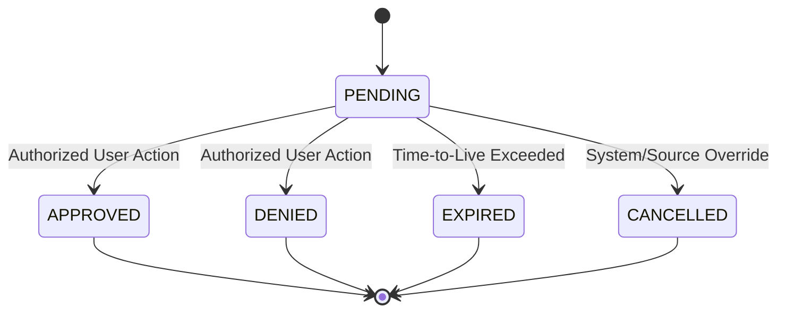

# Phase 6I: Human Approval Workflow

## Overview

The Human Approval Workflow introduces a deterministic lifecycle for execution requests that require explicit authorization (e.g., destructive actions or changes with a large blast radius). It intercepts requests marked as `REQUIRE_APPROVAL` by the Response Safety Policy and manages them through a tenant-safe state machine.

This subsystem provides the following guarantees:
1. **Idempotency:** Re-approving or re-denying a request returns the existing decision state rather than throwing an error or executing the action multiple times.
2. **Tenant Isolation:** A strict mapping between the requested action's organization ID and the approving user's organization ID.
3. **Drift Detection:** A "fresh validation" strategy ensures that the AWS pre-conditions that were true at the time of the request are still true at the time of execution.
4. **Auditability:** Every decision produces a permanent, structured audit log.

## State Machine

The approval state machine is constrained. Transitions can only flow from `PENDING` to a terminal state (`APPROVED`, `DENIED`, `EXPIRED`, `CANCELLED`). Terminal states cannot be altered.



## Security Guarantees

### Tenant Isolation
An incoming approval payload is matched against the reviewer's provided `org_id` and RBAC roles. Users from Organization B cannot access, read, or approve actions for Organization A.

### Late-Stage Freshness (Drift Detection)
When a request is approved, the system does not blindly fire the `ExecutionOrchestrator`. It passes the approved request back into the safety boundaries to re-evaluate cloud preconditions. 
If drift is detected (e.g. an IAM role was already modified out-of-band), the execution is halted and labeled with a `PRECONDITION_FAILED` error.

## Usage

```python
# Create the request
approval_req = ApprovalRequest(
    approval_id="uuid",
    org_id="org1",
    action="RESTRICT_IDENTITY_PRIVILEGE",
    target_id="arn:...",
    ...
)
manager.create_request(approval_req)

# Deny or Approve
manager.approve(approval_req.approval_id, org_id="org1", user_id="u1", role="security_administrator", reason="Looks good")

# Execute
res = manager.execute_approved_request(approval_req.approval_id, execution_req)
```

If an error occurs, it maps cleanly into the `ExecutionErrorCode` enum (e.g., `APPROVAL_REJECTED`, `INVALID_REQUEST`).
